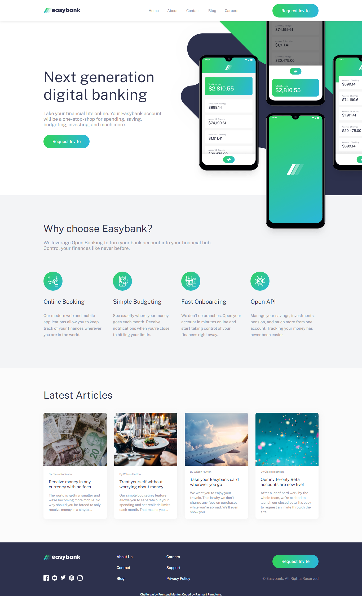

# Frontend Mentor - Easybank landing page solution

This is a solution to the [Easybank landing page challenge on Frontend Mentor](https://www.frontendmentor.io/challenges/easybank-landing-page-WaUhkoDN). Frontend Mentor challenges help you improve your coding skills by building realistic projects. 

## Table of contents

- [Overview](#overview)
  - [The challenge](#the-challenge)
  - [Screenshot](#screenshot)
  - [Links](#links)
- [My process](#my-process)
  - [Built with](#built-with)
  - [What I learned](#what-i-learned)
  - [Continued development](#continued-development)
  - [Useful resources](#useful-resources)
- [Author](#author)
- [Acknowledgments](#acknowledgments)

### The challenge

Users should be able to:

- View the optimal layout for the site depending on their device's screen size
- See hover states for all interactive elements on the page

### Screenshot

### Links

Live Site URL: [Vercel](https://easy-bank-landing-page-seven-rho.vercel.app/)

## My process

I think I did pretty well considering that I focus mainly on CSS styling

### Built with

- Semantic HTML5 markup
- CSS custom properties
- FlexBox
- Javascript
- Sass preprocessor

I said that I won't use any frameworks and build it from scratch to be more exciting and challenging

### What I learned

There's no right way to do it as long as your workflow works for you.

### Continued development

## Author

- Frontend Mentor - [@roy-eugene049](https://www.frontendmentor.io/profile/roy-eugene049)
